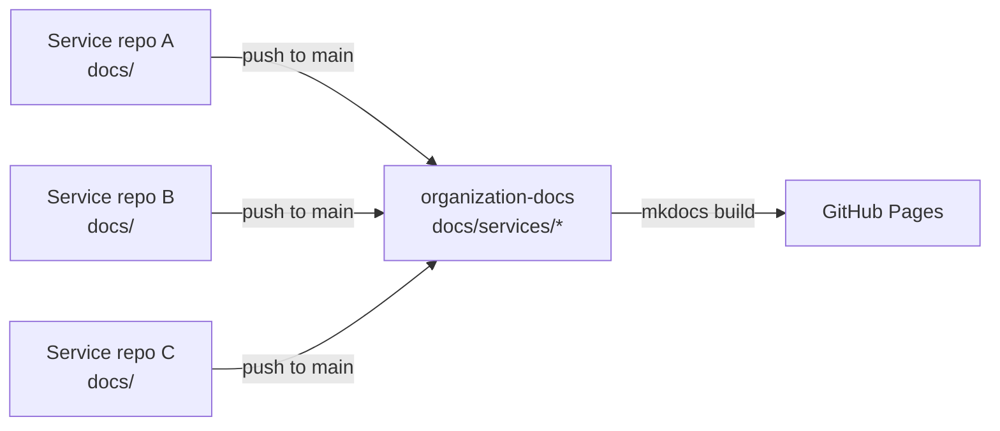

<div align="center">

# 📚 Organization Docs

**Central documentation hub — aggregated automatically from every service repo.**

[](https://github.com/mindwave-th/organization-docs/actions/workflows/build-docs.yml)
[](https://squidfunk.github.io/mkdocs-material/)
[](https://mindwave-th.github.io/organization-docs/)

</div>

---

This repo does **not** hold service docs directly — it aggregates them.
Every service repo pushes its own `docs/` folder here, and this repo
builds + publishes the combined site.

## 🔄 How it works



1. Each service repo has a `docs/` folder and a copy of
   [`templates/sync-to-central-docs.yml`](templates/sync-to-central-docs.yml)
   in its `.github/workflows/`.
2. On every push to that repo's `main` branch, the workflow mirrors its
   `docs/` folder into `docs/services/<repo-name>/` here and commits.
3. `.github/workflows/build-docs.yml` builds the MkDocs site and deploys
   to GitHub Pages on every push to `main`.
4. Nav is generated automatically via `mkdocs-awesome-pages-plugin` — no
   manual `mkdocs.yml` edits when a new service is added.

## ➕ Adding a new repo

See [`templates/README.md`](templates/README.md) for install steps:
copy the sync workflow → set the `DOCS_SYNC_PAT` secret → add a `docs/`
folder → push.

## 🛠️ Local development

```bash
python -m venv .venv && source .venv/bin/activate
pip install -r requirements.txt
mkdocs serve
```

Site builds at `http://127.0.0.1:8000`.

## 📁 Repo structure

| Path | Purpose |
|---|---|
| `docs/` | rendered content — `index.md` + auto-synced `services/` |
| `templates/` | sync workflow template for satellite repos to copy |
| `.github/workflows/` | `build-docs.yml` — builds + deploys this site |
| `mkdocs.yml` | site config + nav plugin |
| `requirements.txt` | Python deps (mkdocs, material theme, awesome-pages) |
