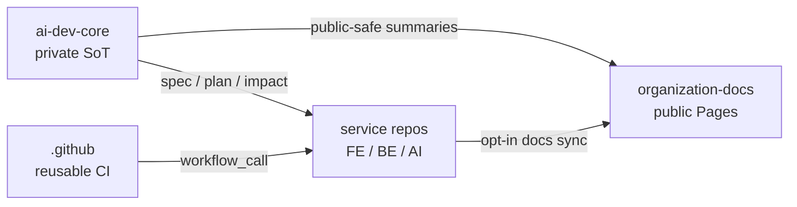
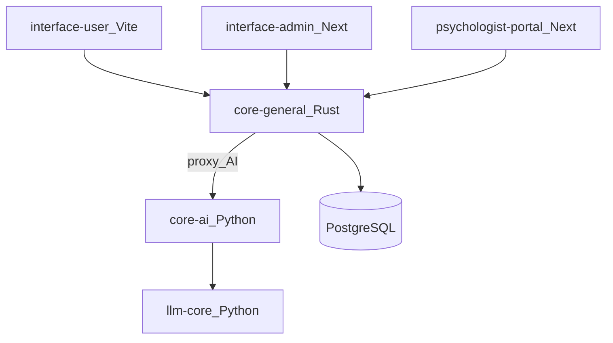

# แผนการทำงานของทีม Mindwave (How we work)

หน้านี้สรุป **สิ่งที่แพลนไว้** ให้ dev / agent / คนใหม่ในทีมอ่านแล้วรู้ว่า
repo ไหนทำอะไร งานไหลยังไง และควรเริ่มจากตรงไหน

> รายละเอียดผลิตภัณฑ์ / backlog / strategy ที่เป็นความลับอยู่ที่
> [`mindwave-th/ai-dev-core`](https://github.com/mindwave-th/ai-dev-core) (private)
> — หน้านี้เป็น **ภาพรวมสาธารณะ** ที่ปลอดภัยต่อการเปิดบน GitHub Pages

---

## 1) สถาปัตยกรรมเป้าหมาย (Target layout)

เราแยกหน้าที่ของ repo ให้ชัด ไม่ยัดทุกอย่างไว้ที่เดียว:

```text
mindwave-th/
├── .github                 ← CI / org templates เท่านั้น
├── organization-docs       ← hub เอกสารสาธารณะ (หน้านี้ / GitHub Pages)
├── ai-dev-core             ← private SoT: product + Spec-Driven Development
└── service repos...        ← โค้ดจริงของแต่ละระบบ
```



| Repo | บทบาท | ใครใช้บ่อย |
|------|--------|------------|
| [`ai-dev-core`](https://github.com/mindwave-th/ai-dev-core) | สมองผลิตภัณฑ์ + มาตรฐาน SDD (constitution, workflow, impact map, product hub) | Product / lead / Cursor agent ตอนออกแบบ |
| [`organization-docs`](https://github.com/mindwave-th/organization-docs) (ที่นี่) | รวมเอกสารที่เปิดได้ + บันทึก CI/governance ของ org | ทุกคน |
| [`.github`](https://github.com/mindwave-th/.github) | reusable workflows + issue/PR templates | CI / platform |
| service repos | implement ตาม spec | Dev รายวัน |

**สถานะล่าสุด:** `ai-dev-core` เป็น SoT แล้ว, `.github/ai-dev-core/` เป็น pointer README แล้ว,
และทั้ง 6 service มี `AGENTS.md` + Cursor rules แล้ว

---

## 2) ทำไมต้องแยกแบบนี้

- **`.github`** ควรเป็นแค่ org defaults + CI — ไม่ใช่ที่เก็บ product brain
- **`ai-dev-core`** เป็น private workspace สำหรับ strategy → backlog → SDD
  (ข้อมูลธุรกิจไม่ควรโผล่บน Pages)
- **`organization-docs`** เป็นกระจกสาธารณะ: สถาปัตยกรรม, วิธีทำงาน,
  README ของ service ที่เปิดได้
- **service repos** โฟกัสโค้ด + `AGENTS.md` / Cursor rules ของ repo นั้น

แนวทางนี้สอดคล้องมาตรฐานปี 2025–2026:
[GitHub Spec Kit](https://github.com/github/spec-kit),
contract-first (OpenAPI), และ impact / ownership map ใน multi-repo

---

## 3) วิธีพัฒนางาน (Spec-Driven Development)

ทีม **ไม่** สั่งแชทแล้วให้ AI เขียนโค้ดยาว ๆ ตรง ๆ
แต่บังคับให้มี intent ก่อน implement:

```text
Brainstorm
   ↓
product/ ใน ai-dev-core   (strategy → … → backlog → trust)
   ↓
feature card พร้อมสถานะ ready
   ↓
/specify  → what & why
   ↓
/plan     → how + impact ครบชั้น (ลำดับทำยืดหยุ่นได้)
   ↓
/tasks    → task cards
   ↓
/implement ใน service repos ที่เกี่ยวข้อง
```

กฎสั้น ๆ ที่ทุกคนต้องจำ:

1. **อย่าแตะชั้นเดียวแล้วจบ** — เช่น มี DB column แต่ไม่มี API/UI
2. **ดู impact map ก่อนลงมือ** — รู้ว่าฟีเจอร์นี้แตะ repo ไหนบ้าง
3. **API เป็นสัญญา** — OpenAPI ของ core เป็นตัวกลาง FE ↔ BE
4. **ลำดับ implement ยืดหยุ่น** — data-first / UI-first / parallel ได้
   ขอแค่ plan บอกชัดและไม่ทิ้งชั้นที่ต้องแตะ

รายละเอียดเต็ม (private): ดู `workflow.md`, `constitution.md`,
`impact-map.md` ใน `ai-dev-core`

---

## 4) แผน rollout (สิ่งที่ทำแล้ว / ต่อไป)

| Phase | งาน | สถานะ |
|-------|-----|--------|
| **1** | เนื้อหา hub (constitution, workflow, impact map, templates, ตัวอย่าง PDPA, product hub) | ✅ ทำแล้ว |
| **1b** | เติม product hub (vision/mission/roadmap/feature cards) | ✅ ส่วนใหญ่ — เหลือเลือก 1 card `ready` แล้วรัน SDD จริงครั้งแรก |
| **1c** | สร้าง private `ai-dev-core` + pointer ที่ `.github` | ✅ ทำแล้ว |
| **2** | ใส่ `AGENTS.md` + Cursor rules ใน 6 service repos | ✅ ทำแล้ว |
| **3** | ยึด OpenAPI ของ `mindwave-core-general` เป็นสัญญา + sync types ฝั่ง FE | ⏳ ยังไม่ทำ |
| **4** | sync สรุป public-safe จาก `ai-dev-core` เข้า Pages (หน้านี้) | ✅ หน้า how-we-work ขึ้นแล้ว |
| **5** | รัน change จริงแนวตั้ง 1 ชิ้น (เช่น PDPA) ตามตัวอย่าง | ⏳ ยังไม่ทำ |

### CI / platform (คู่ขนาน)

ดูรายละเอียดใน [หน้าแรก](index.md) — สรุปสั้น ๆ:

- ✅ reusable CI เรียกจากทุก service แล้ว (`ci.yml`)
- ⛔ `deploy.yml` (Railway) ยังไม่ roll out
- ⛔ branch protection บน private repo ติดข้อจำกัด GitHub Free
- ✅ bot sync caller workflows อยู่ที่ `organization-docs`

---

## 5) วันต่อวันของ dev ควรทำยังไง

### ถ้างานเป็นฟีเจอร์ใหม่ / ข้ามหลาย repo

1. เปิด Cursor ที่ **`ai-dev-core`** (ไม่ใช่ service เดี่ยวทันที)
2. อัปเดตหรืออ่าน `product/` ให้ตรงความเข้าใจล่าสุด
3. สร้าง/เลือก feature card → เมื่อ `ready` แตกเป็น change
   (`spec` / `plan` / `tasks`)
4. กรอก impact จาก impact map
5. implement ใน service repos ตาม tasks (ลิงก์ PR ข้าม repo ใน plan)
6. ปิด acceptance แล้ว archive change

### ถ้างานเล็กใน repo เดียว (bugfix, UI copy)

- ทำใน service repo นั้นได้เลย
- แต่ถ้าแตะ schema / API / contract ใหม่ → กลับไปข้อด้านบน

### ไฟล์ที่ทุก service มีแล้ว (Phase 2 ✅)

- `AGENTS.md` ที่ root
- `.cursor/rules/api-contract.mdc`
- `.cursor/rules/coherence.mdc`

---

## 6) แผนที่ระบบแบบย่อ (ใครเป็นเจ้าของอะไร)



| Keyword | เปิด repo หลัก |
|---------|----------------|
| login / register customer | `core-general` + `interface-user` |
| PDPA / consent / PII | `core-general` (+ user FE, บางที admin) |
| assessment / mind dump | `core-general` + `interface-user` |
| admin dashboard | `core-general` `/admin` + `interface-admin` |
| psychologist chat | `core-general` `/psy` + `psychologist-portal` |
| model / temperature / thinking | `llm-core` (+ `core-ai`) |
| CI / deploy templates | `.github` |
| เอกสารรวม org | `organization-docs` (ที่นี่) |

---

## 7) ลิงก์ที่ใช้บ่อย

| ลิงก์ | เพื่ออะไร |
|------|-----------|
| [ai-dev-core](https://github.com/mindwave-th/ai-dev-core) | SoT ส่วนตัว — product + SDD |
| [.github](https://github.com/mindwave-th/.github) | reusable workflows |
| [หน้าแรก organization-docs](index.md) | CI / secrets / inventory |
| [docs/services/](services/) | README ที่ sync จากแต่ละ service |
| [GitHub Spec Kit](https://github.com/github/spec-kit) | มาตรฐาน process ที่เราอ้างอิง |

---

## 8) สิ่งที่ยังไม่ทำ (ให้ทีมไม่สับสน)

- ยังไม่บังคับ branch protection บน private service repos (ข้อจำกัดแผน GitHub Free)
- Railway deploy ยังไม่เปิดผ่าน `deploy.yml`
- `CODEOWNERS` ยังมี placeholder team
- ยังไม่ได้รัน SDD change จริง end-to-end ครั้งแรก (Phase 5)
- OpenAPI เป็นสัญญาครบวงจรฝั่ง FE ยังไม่ปิด (Phase 3)

ถ้าสงสัยว่า “ของชิ้นนี้ควรอยู่ repo ไหน / ต้องมี spec ไหม” —
เริ่มที่ **`ai-dev-core`** ก่อนเสมอ แล้วค่อยลงมือใน service
