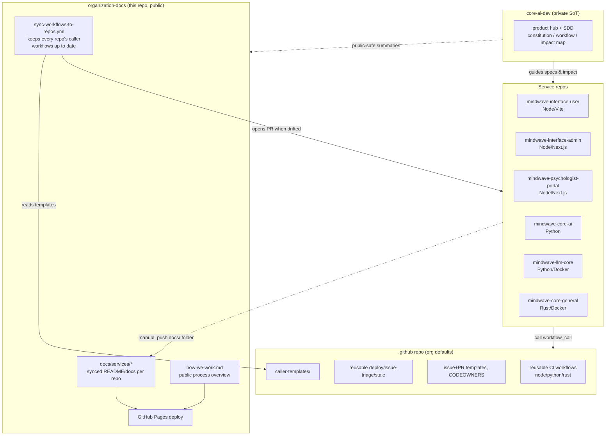

# Organization Documentation

Central hub for `mindwave-th` — documentation aggregated from every
service repo, plus a record of how CI/CD, issue automation, and repo
governance are wired up across the org.

> **สำหรับทีม dev:** อ่านแผนการทำงาน / บทบาทของแต่ละ repo / SDD ก่อนที่
> [`How we work`](how-we-work.md) — สรุปว่าแพลนไว้ยังไง และควรเริ่มงานจากตรงไหน

> **กฎสำคัญ:** ถ้าเปลี่ยน working flow / org process ต้องอัปเดตเอกสารที่เกี่ยวใน change เดียวกัน
> (ดู [`DOC_SYNC.md`](https://github.com/mindwave-th/core-ai-dev/blob/main/DOC_SYNC.md)
> และส่วนใน [`How we work`](how-we-work.md#9-กฎ-เปลี่ยน-flow-แล้วต้องอัปเดตเอกสาร))

## Architecture



## The four pieces

### 0. How the team builds features (start here)

See **[How we work](how-we-work.md)** for the intended layout:

```text
core-ai-dev (private) → specs / product
        ↓
service repos → implementation
        ↓
.github → CI only
organization-docs → public docs (this site)
```

That page covers Spec-Driven Development, rollout phases, and day-to-day
expectations for developers. Private product detail stays in
[`core-ai-dev`](https://github.com/mindwave-th/core-ai-dev).

**Process changes require doc sync** — update related docs in the same
change ([`DOC_SYNC.md`](https://github.com/mindwave-th/core-ai-dev/blob/main/DOC_SYNC.md)).

### 1. Central docs hub (this repo)

Two ways content ends up under `docs/services/<repo>/`:

- **One-time pull (already done):** README.md + other root `.md` files
  (CHANGELOG, DEPLOYMENT, requirement.md) copied in directly from all 6
  service repos. One page per file, browsable via the nav.
- **Ongoing, opt-in push:** if a repo adds a `docs/` folder, copying
  [`templates/sync-to-central-docs.yml`](https://github.com/mindwave-th/organization-docs/blob/main/templates/sync-to-central-docs.yml)
  into its own `.github/workflows/` makes it auto-mirror that folder
  here on every push to `main`. Needs a `DOCS_SYNC_PAT` secret
  (contents:write on this repo). None of the 6 repos have adopted this
  yet — they only have the one-time README pull so far.

Nav is fully automatic (`mkdocs-awesome-pages-plugin`, no `nav:` key in
`mkdocs.yml`) — any new file under `docs/` just appears.

**Why this repo is public:** GitHub Pages and branch protection both
require a paid plan for *private* repos on GitHub Free. Making this
repo public was the trade-off to get Pages working — accepted knowingly,
since the synced content (architecture docs, READMEs) was judged OK to
expose. Live at <https://mindwave-th.github.io/organization-docs/>.

### 2. CI/CD

Reusable workflows live in
[`mindwave-th/.github`](https://github.com/mindwave-th/.github)
(`reusable-node-ci.yml`, `reusable-python-ci.yml`, `reusable-rust-ci.yml`,
`reusable-railway-deploy.yml`). Each service repo has small caller files
in its own `.github/workflows/` (`ci.yml`, and eventually `deploy.yml`)
that reference these by `uses: mindwave-th/.github/.github/workflows/...@main`.

- Lint/fmt/clippy steps are **non-blocking** (`continue-on-error: true`)
  for now, since no repo had a clean baseline at rollout — flip that off
  per-repo once lint passes clean.
- Deploy target is **Railway**, triggered on push to `main` after CI
  passes. Needs an org secret `RAILWAY_TOKEN` and each repo's
  `deploy.yml` filled in with its real Railway service name
  (`CHANGE_ME` placeholder in the template) — **not rolled out yet**,
  only `ci.yml` is live everywhere.

**Auto-sync bot:** `organization-docs`'s
[`sync-workflows-to-repos.yml`](https://github.com/mindwave-th/organization-docs/blob/main/.github/workflows/sync-workflows-to-repos.yml)
runs weekly (or on manual dispatch), detects each repo's stack from its
GitHub-reported languages, and opens a PR on any repo whose
`ci.yml`/`issue-triage.yml`/`stale.yml` drifted from the template in
`.github`'s `caller-templates/`. New repos get picked up automatically
on the next weekly run. It needs `ORG_WORKFLOW_SYNC_PAT` (classic PAT,
`repo`+`workflow` scopes) — `GITHUB_TOKEN` can't write workflow files.

> Quirk worth knowing: this bot could **not** live in the `.github` repo
> itself — GitHub Actions doesn't pass organization secrets to
> workflows running in a repo literally named `.github` (confirmed by
> testing, not documented by GitHub anywhere). That's why the bot lives
> in `organization-docs` instead, checking out `.github` via PAT just
> to read `caller-templates/`.

### 3. Issue automation

From `mindwave-th/.github`:

- **Issue forms** (`bug_report.yml`, `feature_request.yml`) —
  auto-labeled (`bug` / `enhancement`) via the form's own `labels:` key,
  no workflow needed. Free-text issues disabled (`blank_issues_enabled: false`).
- **issue-triage.yml** (reusable) — assigns a default owner and/or adds
  the issue to a GitHub Projects v2 board, both config-driven
  (`default-assignee`, `project-url` inputs) so it's a no-op until a
  repo's caller fills them in. Project-board sync needs a
  `PROJECTS_PAT` org secret (classic PAT, `project` scope) — **not
  created yet**.
- **stale.yml** (reusable) — auto-labels + closes inactive issues/PRs
  after 30/7 days (configurable). Live on all 6 repos.
- **CODEOWNERS** — org default at `.github/CODEOWNERS` still has a
  placeholder team (`@mindwave-th/maintainers`) that doesn't exist yet.
  Auto-request-review won't work until real usernames/team replace it.

### 4. PR / branch rules — decided, awaiting org upgrade

- **Why it was blocked:** GitHub Free cannot enforce required reviews or
  required status checks on private repos (tested against both branch
  protection and rulesets APIs).
- **Decision (2026-09-23):** upgrade the org to **GitHub Team** with 3 seats —
  `Phichetlog10` (product owner, internal clinical lead), `Pakawat-Tan`
  (dev), `teerapon19` (DevOps). Outside collaborator `AumChayanon` and the
  unused `mindwavehealth` account are to be removed after pre-checks
  (e.g. who owns `ORG_WORKFLOW_SYNC_PAT`).
- **Planned rules:** one org ruleset on integration/deploy branches of every
  repo except the private product hub — pull request required (1 approval),
  code-owner review required, conversations resolved, no force-push or
  deletion, empty bypass list. Required CI checks are added per repo.
- **Review model:** code review pairs — Phichet's PRs → Pakawat,
  Pakawat's → Teerapon, Teerapon's → Pakawat. Phichet reviews clinical
  content only; clinical-safety paths follow risk tiers A/B/C, with tier A
  needing a licensed clinician's sign-off.
- **Repo side already prepared:** branch `chore/agent-protocol-v2` in each
  service repo adds `AGENTS.md`, `.github/CODEOWNERS` and a PR template.

**Net status:** until the upgrade and ruleset are applied, no private repo
blocks direct pushes to `main`.

## Repo inventory

| Repo | Stack | `ci.yml` | `deploy.yml` | Visibility |
|---|---|---|---|---|
| mindwave-interface-user | Node (Vite) | ✅ | ⛔ not rolled out | private |
| mindwave-interface-admin | Node (Next.js) | ✅ | ⛔ not rolled out | private |
| mindwave-psychologist-portal | Node (Next.js) | ✅ | ⛔ not rolled out | private |
| mindwave-core-ai | Python | ✅ | ⛔ not rolled out | private |
| mindwave-llm-core | Python (Docker) | ✅ | ⛔ not rolled out | private |
| mindwave-core-general | Rust (Docker) | ✅ | ⛔ not rolled out | private |
| **core-ai-dev** | product + SDD hub | n/a | n/a | **private** |
| AI_OS | none (empty repo) | — | — | private |
| organization-docs | Python/MkDocs | n/a | n/a | **public** |
| .github | n/a (org defaults) | n/a | n/a | private |

## Secrets inventory

| Secret | Scope | Purpose | Status |
|---|---|---|---|
| `ORG_WORKFLOW_SYNC_PAT` | org | writes workflow files cross-repo for the sync bot | ✅ created |
| `RAILWAY_TOKEN` | org | `railway up` in `reusable-railway-deploy.yml` | ⛔ not created |
| `PROJECTS_PAT` | org | add issues to a Projects v2 board | ⛔ not created |
| `DOCS_SYNC_PAT` | per-repo | opt-in docs-folder push sync (§1) | ⛔ not created anywhere |

## Known issues

- `mindwave-interface-user`'s README is genuinely mis-encoded at the
  source (BOM + mixed-encoding bytes) — renders as mojibake on its
  synced page. Not something to guess-repair; needs a fix upstream.
- `CODEOWNERS` placeholder team doesn't exist — replace before relying
  on auto-request-review.

## Adding a new repo

1. Give it a `docs/` folder if you want it in the opt-in push-sync
   (§1) — otherwise it just gets picked up in the next full pull if
   one is re-run manually.
2. Nothing to do for CI — `sync-workflows-to-repos.yml` (§2) onboards
   it automatically within a week, or trigger it manually via Actions →
   "Sync caller workflows to org repos" → Run workflow.
3. `deploy.yml` and branch protection are still manual steps for every
   repo today (see §2 and §4 above).
