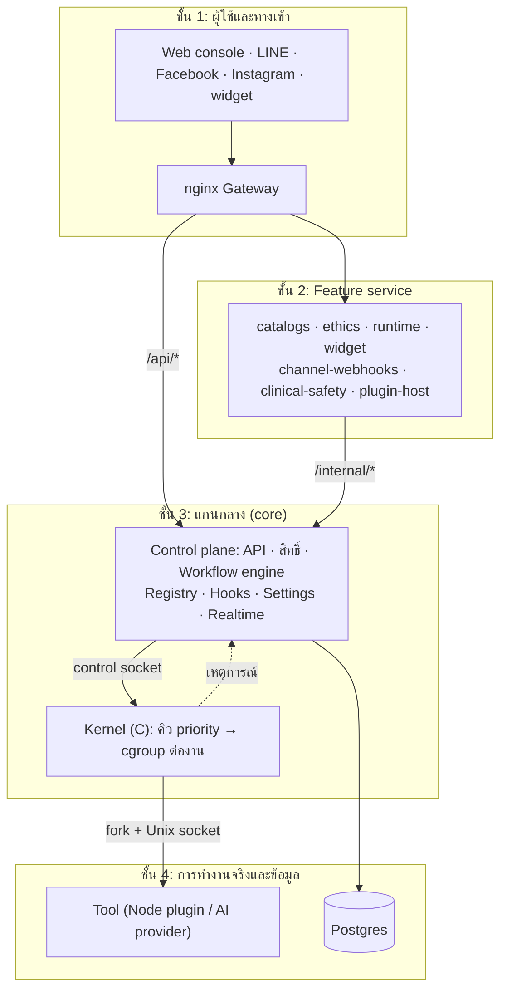
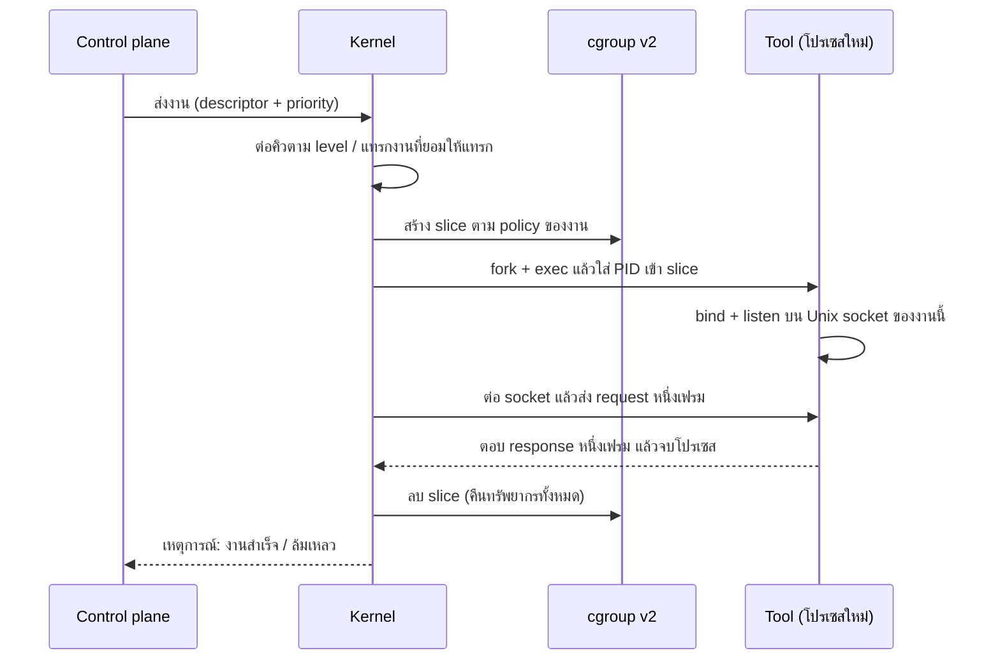
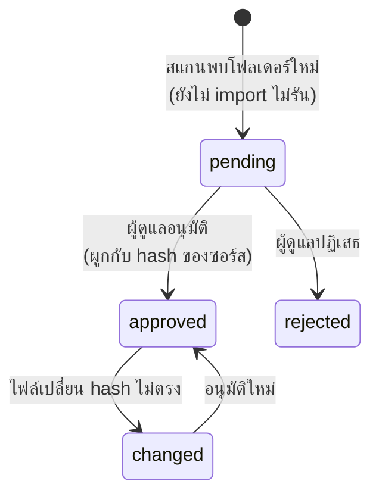

<div align="center">

# 🧠 Mindwave-AI

**แพลตฟอร์มออโตเมชันเวิร์กโฟลว์สำหรับแชทบอทสุขภาพจิต Mindwave**

Kernel ภาษา C จัดคิวและแยกงานตามความสำคัญ · Control plane ด้วย FastAPI ·
Console ด้วย React · ขยายได้ด้วย plugin


[เริ่มต้นใช้งาน](#-เริ่มต้นใช้งาน) ·
[สถาปัตยกรรม](#%EF%B8%8F-สถาปัตยกรรม) ·
[Module](#-module) ·
[การพัฒนา](#-การพัฒนา) ·
[เอกสาร](#-เอกสาร) ·
[ความปลอดภัย](#-ความปลอดภัย)

</div>

---

## ✨ จุดเด่น

| | |
|---|---|
| ⚙️ **Kernel แยกงานจริง** | ทุกงานได้ cgroup v2 ของตัวเอง คืนทรัพยากรเมื่อจบหรือล่ม |
| 🎚️ **Priority tier** | ระดับ free / plus / premium / dev ตั้งค่าและปรับผ่านเว็บ |
| 🧩 **ปลั๊กอินอัตโนมัติ** | วางโฟลเดอร์แล้วระบบค้นพบเอง อนุมัติแล้วทำงานทันทีโดยไม่ restart |
| 🪝 **Event hook** | ส่ง webhook ที่เซ็นลายเซ็น HMAC เมื่อเกิดเหตุการณ์ 20 ชนิด |
| ⚡ **เรียลไทม์** | console อัปเดตสดผ่าน SSE ไม่ต้องรีเฟรช |
| 🔐 **PDPA** | ข้อมูลส่วนบุคคลเข้ารหัสรายฟิลด์ แยกฐานข้อมูล และแยกสิทธิ์ต่อ service |
| 🛠️ **ตั้งค่าผ่านเว็บ** | ค่าปฏิบัติการทั้งหมดแก้ใน Settings ได้ ไม่ต้อง restart |

## 📋 สิ่งที่ต้องมี

- 🐳 Docker (Compose v2) บน Linux หรือ Docker Desktop บน macOS
- 🐘 PostgreSQL บนเครื่องโฮสต์ (ไม่ได้อยู่ใน compose) พร้อมฐานข้อมูลสองก้อน:
  `ai_core` (ระบบ) และฐานข้อมูลผู้ใช้ที่แยกต่างหาก (ข้อมูลส่วนบุคคล)
- 🟢 Node 22 ใช้เฉพาะในคอนเทนเนอร์ `web` ไม่ต้องติดตั้งบนเครื่อง

## 🚀 เริ่มต้นใช้งาน

**1. ตั้งค่า environment**

```bash
cp .env.example .env
```

กรอก `DB_*`, `USER_DB_NAME`, คีย์ Fernet และ pepper
(คำสั่งสร้างคีย์อยู่ในคอมเมนต์ของ `.env.example`)

**2. เริ่มระบบ**

```bash
docker compose up -d                       # โหมด monolith  → console + API :8000
docker compose --profile services up -d   # โหมด services  → gateway :8080
```

**3. สร้างแอดมินคนแรก** (ไม่มีหน้าสมัครสมาชิกสาธารณะ)

```bash
docker compose exec kernel-server python -m Server.api.create_admin
```

> [!NOTE]
> Schema migration ทำงานอัตโนมัติทุกครั้งที่ `kernel-server` เริ่มต้น

| URL | คืออะไร |
|---|---|
| http://localhost:8000 | 🖥️ Console + Control plane API (core) |
| http://localhost:8080 | 🚪 Gateway (โหมด services) |

> [!TIP]
> ถ้า Docker Desktop รีเซ็ตแล้วคอนเทนเนอร์หาย รัน
> `docker compose --profile services up -d` เพื่อเรียกทุกอย่างกลับมา
> (image และ Postgres บนโฮสต์ยังอยู่)

### 🐳 รันด้วย Docker ไฟล์เดียว (ไม่ต้องมี Postgres ภายนอก ไม่ใช้ compose)

`Dockerfile` ที่ root สร้าง image เดียวที่มีทั้ง Kernel (Release), control plane, console และ PostgreSQL
ในตัว โค้ดฝังอยู่ใน image

```bash
docker build -t mindwave-ai .
docker run -d --name mindwave --privileged --cgroupns private \
  -p 8000:8000 -v mindwave-data:/data mindwave-ai
docker logs mindwave        # ดู username / password สำหรับเข้าครั้งแรก (แสดงครั้งเดียว)
```

เปิด http://localhost:8000 ล็อกอินด้วย username `admin` กับรหัสสุ่มจาก log ระบบบังคับให้เปลี่ยนตอนเข้าครั้งแรก

ครั้งแรกที่รัน (ไม่ตั้ง `DB_HOST`) container จะ:
1. สร้างคีย์เข้ารหัสทั้ง 4 ตัว เก็บที่ `/data/secrets.env`
2. เปิด PostgreSQL ในตัว (ข้อมูลอยู่ใน `/data/pgdata`) สร้างฐานข้อมูล `ai_core` และ `user_db`
3. migrate และสร้างแอดมินคนแรก

รีสตาร์ตครั้งถัดไปใช้คีย์และข้อมูลเดิมใน volume `mindwave-data` ไม่สร้างซ้ำ

> [!WARNING]
> **สำรอง volume `/data` โดยเฉพาะ `secrets.env`** ถ้าคีย์หาย ข้อมูลที่เข้ารหัสจะอ่านไม่ได้อีก
> ตั้งชื่อแอดมินเองด้วย `-e ADMIN_USERNAME=... -e ADMIN_PASSWORD=...` ได้

**ใช้ Postgres ภายนอก:** ใส่ `--env-file .env` (ต้องมี `DB_HOST`, `DB_PASSWORD`, `DB_NAME`, `USER_DB_NAME`
และคีย์ทั้ง 4 ตัว) โหมดนี้ไม่สร้างคีย์ให้เอง เพื่อไม่ให้ทำข้อมูลที่เข้ารหัสไว้แล้วใช้ไม่ได้
พอร์ตอ่านจาก `PORT` ถ้ามี ไม่เช่นนั้น `API_PORT` (8000)

> [!WARNING]
> Kernel แยก cgroup v2 ต่อหนึ่งงาน จึงต้องใช้ `--privileged --cgroupns private` ถ้าแพลตฟอร์มไม่ให้
> (เช่น Railway) API และหน้า console จะขึ้น แต่ **งานจะรันไม่ได้** container จะเตือนใน log
> image นี้เป็นโหมด monolith ส่วนโหมดแยก service ใช้ `docker compose --profile services`

## ⚙️ การตั้งค่า

- 🔑 **ความลับและโครงสร้างพื้นฐาน** (รหัสผ่านฐานข้อมูล คีย์ PDPA โทเคนภายใน)
  อ่านจาก `.env` เท่านั้น ใช้ `.env.example` เป็นแม่แบบ
- 🎛️ **ค่าปฏิบัติการทั้งหมด** (ขีดจำกัด ระยะเก็บข้อมูล ความถี่สแกน plugin
  ระดับ priority hook) แก้ในคอนโซลที่เมนู **Settings** ไม่ต้อง restart
- 🏭 **การ build Kernel** เป็น Release ไม่มี sanitizer เสมอ (กำหนดใน `Dockerfile` ไม่มีตัวแปรให้ตั้ง)

> [!WARNING]
> ห้าม commit `.env` และต้องสำรองไฟล์คีย์ก่อน deploy เพราะถ้าคีย์หาย
> ข้อมูลที่เข้ารหัสจะอ่านไม่ได้อีก ดู คู่มือสำรองคีย์

## 🏗️ สถาปัตยกรรม

ภาพรวมของโครงสร้างและการไหลของการทำงาน ส่วนรายละเอียดของแต่ละชิ้นอยู่ใน
[Module](#-module) ด้านล่าง

**หลักคิดข้อเดียว: Kernel ไม่รู้ว่างานที่ตัวเองรันคืออะไร** Kernel รู้แค่ว่างานหนึ่งงาน
มีระดับความสำคัญเท่าไรและต้องเรียกโปรแกรมตัวไหน ความสามารถทั้งหมดอยู่ใน Plugin
ซึ่งเพิ่ม ลด และอัปเดตได้โดยไม่แก้หรือ compile Kernel ใหม่

### การทำงานแบบระดับชั้น (Layered)

ระบบแบ่งเป็น 4 ชั้น เรียงจากบนลงล่าง **ชั้นบนเรียกชั้นล่างได้ ชั้นล่างไม่เรียกขึ้นมาเอง**
(ข้อยกเว้นเดียวคือการส่ง *เหตุการณ์* ขึ้นไปแจ้งชั้นบน)



| ชั้น | รับผิดชอบ | เรียกใครได้ | ข้อห้าม |
|---|---|---|---|
| **1 ผู้ใช้และทางเข้า** | ต้นทางของคำขอทั้งหมด และ gateway ที่แจกจ่ายตามพาธไป core หรือ service | ชั้น 2 และ 3 | ไม่มี business logic ไม่เปิด `/internal/*` ออกข้างนอก ไม่ต่อฐานข้อมูลตรงๆ |
| **2 Feature service** | โดเมนของแต่ละ feature (จริยธรรม คลังคำ วิดเจ็ต ความปลอดภัย ฯลฯ) | ชั้น 3 ผ่าน `/internal/*` | ไม่ถือคีย์เข้ารหัส ไม่เขียน audit เอง ไม่คุย Kernel ตรงๆ |
| **3 แกนกลาง** | *Control plane* ตรวจสิทธิ์ เก็บ config เดินเวิร์กโฟลว์ และ *Kernel* จัดคิวแยกและคืนทรัพยากร | ชั้น 4 (Tool ที่ Kernel fork และฐานข้อมูล) | Control plane ไม่จัด CPU/หน่วยความจำต่องานเอง Kernel ไม่มี business logic ไม่ถือคีย์เข้ารหัส |
| **4 Tool และข้อมูล** | ทำงานจริงของโหนด/provider และเก็บข้อมูล | (ชั้นล่างสุด) | Tool ต่อ Kernel เองไม่ได้ Kernel เป็นฝ่ายเรียก |

> [!NOTE]
> ชั้น 3 รวม Control plane กับ Kernel ไว้ด้วยกัน เพราะรันใน container เดียว (`kernel-server`)
> และคุยกันผ่าน control socket แต่ทั้งสองยังแยกหน้าที่ชัด: Control plane ตัดสินว่า *ส่งอะไร*
> Kernel ตัดสินว่า *รันเมื่อไรและใช้ทรัพยากรเท่าไร*

**ทำไมแบ่งแบบนี้**
- **ความเสียหายไม่ลามขึ้น:** Tool ล่ม → ถูกกักที่ cgroup และโปรเซสของตัวเอง Kernel ไม่ตาม
  service ถูกเจาะ → เข้าถึงได้แค่ตารางและ endpoint ที่ core อนุญาตให้ service นั้น
- **สิทธิ์แคบลงเรื่อยๆ ยิ่งลงล่าง:** คีย์เข้ารหัสอยู่ที่ชั้น 3 เท่านั้น service ต้องขอให้ core
  เข้า/ถอดรหัสให้ ส่วนฐานข้อมูลก็มี login แยกต่อ service พร้อม Row-Level Security
- **เปลี่ยนชั้นหนึ่งโดยไม่กระทบชั้นอื่น:** เพิ่ม feature = เพิ่ม service ในชั้น 2 เพิ่ม provider =
  เพิ่มแถวใน `tools` ที่ชั้น 4 ไม่ต้องแตะ Kernel

**ตัวอย่าง: ข้อความ LINE หนึ่งข้อความไหลผ่านชั้นต่างๆ**

1. **ชั้น 1:** LINE ส่ง webhook มาที่ gateway
2. **ชั้น 2:** service `channel-webhooks` ตรวจลายเซ็นของ LINE (ไม่ใช้ session ผู้ดูแล)
3. **ชั้น 2→3:** เรียก core ผ่าน `/internal/*` เพื่อสตาร์ตเวิร์กโฟลว์ (ไม่มีคีย์และไม่เขียน DB ระบบเอง)
4. **ชั้น 3:** workflow engine เดินกราฟทีละโหนด ส่งแต่ละโหนดเป็นงานให้ Kernel
   ซึ่งจัดคิวตาม priority สร้าง cgroup แล้ว fork Tool
5. **ชั้น 4:** Tool (เช่น `crisis.detect`, `model`, `line.reply`) ทำงานและคืนผล ข้อมูลส่วนบุคคล
   เขียนลง `user_db` ผ่านโหนด `database` ที่เข้ารหัสฟิลด์
6. **ขากลับ:** Kernel ส่งเหตุการณ์ขึ้น Control plane → เดินโหนดถัดไป → hooks และ Realtime แจ้งหน้า console

> [!NOTE]
> ในโหมด monolith (`docker compose up -d`) ชั้น 2 ถูก mount เข้าไปในโปรเซสของชั้น 3
> เส้นแบ่งเชิงตรรกะยังเหมือนเดิม แต่ไม่มีกำแพงระหว่าง container

### การไหลของหนึ่งงาน



- **Kernel เป็นฝ่ายต่อเข้าหา Tool** ไม่ใช่ Tool มาลงทะเบียนตอนรัน การลงทะเบียนเกิดที่
  ระดับ config (แถวในตาราง `tools`) เท่านั้น
- ใช้ Unix socket ไม่ใช่ gRPC และไม่ฝัง Python ใน Kernel เพื่อให้ Tool เป็นโปรเซสแยกจริง
  (ล่มแยก มี cgroup แยก) Tool ที่พังจึงไม่กระทบ Kernel

### วงจรชีวิตของ plugin



## 🧱 Module

แต่ละ module มี หน้าที่ ตำแหน่ง วิธีทำงาน และจุดตั้งค่า แยกกัน อ่านทีละตัวได้

| # | Module | ตำแหน่ง | สั้นๆ |
|---|---|---|---|
| 1 | [Kernel](#1--kernel) | `Core/Kernel` | จัดคิวและแยกทรัพยากรต่องาน |
| 2 | [Tool shim](#2--tool-shim) | `Tools/mindwave_tool_shim` | ทำให้ฟังก์ชัน Python เป็น Tool |
| 3 | [Node plugin](#3--node-plugin) | `Core/Plugin/node` | โหนดของเวิร์กโฟลว์ |
| 4 | [Feature plugin](#4--feature-plugin) | `Core/Plugin/feature` | เพิ่ม API และหน้า UI |
| 5 | [Plugin registry](#5--plugin-registry) | `Server/api/plugin_*.py` | ค้นพบและอนุมัติ plugin |
| 6 | [Control plane](#6--control-plane) | `Server/api` | API, workflow engine, สิทธิ์ |
| 7 | [Event hooks](#7--event-hooks) | `Server/api/hooks*.py` | ส่งเหตุการณ์ออกไปข้างนอก |
| 8 | [Settings](#8--settings) | `Server/api/settings_registry.py` | ตั้งค่าผ่านเว็บ ไม่ต้อง restart |
| 9 | [Realtime](#9--realtime) | `Server/api/live.py` | อัปเดตหน้าจอสด |
| 10 | [Console](#10--console) | `Web` | หน้าจอผู้ดูแล |
| 11 | [Gateway และ Service](#11--gateway-และ-service) | `Docker/`, `docker-compose.yml` | แยก feature เป็น container |
| 12 | [ฐานข้อมูลและ PDPA](#12--ฐานข้อมูลและ-pdpa) | `Server/db` | แยกข้อมูลระบบ/ข้อมูลส่วนบุคคล |

### 1) 🧠 Kernel

**หน้าที่:** จัดคิวงานตามความสำคัญและแยกทรัพยากรต่องาน เป็น daemon โปรเซสเดียวภาษา C
ใช้ epoll ไม่มี business logic (แยกโค้ดเป็น `sched`, `proc`, `net`, `config`, `log`)

**ทำงานอย่างไร**
- **จัดคิวตามความสำคัญ:** แต่ละงานผูกกับ priority policy หนึ่งแถว (level, เพดาน CPU,
  เพดานหน่วยความจำ, ถูกแทรกได้หรือไม่) Kernel หยิบงานที่ **level น้อยกว่าก่อน**
  ถ้าทรัพยากรเต็ม งานระดับสูงกว่าหยุดงานที่ *ยอมให้ถูกแทรก* แล้วนำกลับเข้าคิว
- **แยกทรัพยากรจริง:** ทุกงานได้ cgroup v2 ของตัวเองตาม policy และ Kernel ลบทิ้งเมื่อ
  งานจบ ล่ม หรือหมดเวลา ตรวจแล้วว่าหลังงานหลายร้อยงานไม่เหลือโปรเซส cgroup socket หรือ zombie
- **รู้จัก Tool ผ่านทะเบียน:** Tool คือแถวในตาราง `tools` (ชื่อ, `exec_command`, `config`)
  Kernel ไม่มี `if tool == "..."` เพิ่ม provider ใหม่คือเพิ่มแถว ไม่ใช่แก้ Kernel
- **ทนต่อ Tool ที่พัง:** socket ขาด = ลบ cgroup ทันที ทำเครื่องหมายว่าล้มเหลว แล้วส่งเหตุการณ์
  กลับเพื่อ retry ตามนโยบายที่ตั้งจากเว็บ

**ตั้งค่าที่ไหน:** ตาราง `priority_policies` ผ่าน **Settings → Priority Slots** และ
`max_concurrent` ใน Kernel config tier ที่ตั้งไว้เรียงต่ำไปสูง:
`free` (30) → `plus` (20) → `premium` (10) → `dev` (0) โดย free กับ plus ถูกแทรกได้

**การ build:** Release ไม่มี sanitizer เสมอ (สร้างในขั้นตอนของ `Dockerfile`)

> [!NOTE]
> งานระดับ priority เดียวกันยังไม่รับประกันลำดับเข้าก่อนออกก่อน (FIFO) เคร่งครัด
> เอกสาร: [Kernel core design](kernel-core-design.md)

### 2) 🔌 Tool shim

**หน้าที่:** ไลบรารี Python บางๆ ที่ทำให้ฟังก์ชันธรรมดากลายเป็น Tool ของ Kernel โดย
ไม่ต้องเขียนโปรโตคอล socket เอง (`run_tool`)

**ทำงานอย่างไร:** เปิด Unix socket ตามพาธที่ Kernel ส่งมา รับ request หนึ่งเฟรม เรียกฟังก์ชัน
ส่ง response หนึ่งเฟรม แล้วจบโปรเซส Node plugin ทุกตัวเรียกใช้ผ่าน runtime ของ plugin

**เอกสาร:** Python tool shim

### 3) 🧩 Node plugin

**หน้าที่:** หนึ่งโหนดของเวิร์กโฟลว์ = หนึ่งไดเรกทอรี ตอนนี้มี 73 แพ็กเกจ เช่น `line.trigger`,
`crisis.detect`, `model`, `database`, `condition`, `flow.*`

```text
Core/Plugin/node/condition/
├── manifest.json   ชื่อ, เวอร์ชัน, entrypoint, handler, สถานะ, adapter ที่ต้องใช้
├── run.py          ไฟล์ที่ Kernel เรียก (executable) → run_plugin(...)
├── handler.py      ตัวประมวลผลของโหนดนี้
├── functions.py    helper และค่าคงที่
├── schema.py       พอร์ตและ schema ของ config
└── __init__.py
```

**ทำงานอย่างไร:** Kernel เรียก `run.py` runtime (`Core/Plugin/runtime.py`) โหลดแพ็กเกจในโปรเซส
ของงานนั้น ประกอบ `ExecutionContext` แล้วเรียก handler

```json
{"inputs": {"in": {"text": "hello"}}, "config": {"function": "uppercase"}}
```

คืน `outputs` ตามพอร์ตขาออก, `variables` และ `meta.plugin_revision` การส่งต่อไปโหนดถัดไป
เป็นหน้าที่ของ workflow engine

| คุณสมบัติ | อธิบาย |
|---|---|
| แยกโปรเซสต่องาน | งานหนึ่งล้ม/ค้างไม่กระทบงานอื่นหรือ Kernel |
| ไม่ import เข้า Server | catalog อ่านแค่ `manifest.json` จากดิสก์ โค้ดโหนดไม่ถูกโหลดเข้า control plane |
| อัปเดตสดโดยไม่ restart | งานใหม่อ่านซอร์สล่าสุด งานที่เริ่มแล้วใช้ snapshot เดิมจนจบ |
| นำออกอย่างปลอดภัย | ต้อง disable/delete Tool ก่อนลบโฟลเดอร์ |

โหนดที่พึ่งบริการภายนอก (LLM, LINE, ฐานข้อมูลผู้ใช้) ต้องผูก credential ที่เข้ารหัสผ่านหน้าเว็บก่อน
เรียก LLM ผ่าน REST ด้วย `httpx` ไม่มี SDK ของ provider

> [!NOTE]
> snapshot ครอบคลุมไฟล์ `.py` และ `.json` ในแพ็กเกจ ไฟล์ข้อมูลภายนอกและ native library
> ที่ handler เปิดเองไม่ถูก freeze  เอกสาร: Node plugins

### 4) 🧷 Feature plugin

**หน้าที่:** ขยาย **control plane และ console** ด้วยเส้นทาง API และหน้า UI ของตัวเอง
ไม่ได้ทำงานในคิวของ Kernel

```text
Core/Plugin/feature/ethics/
├── manifest.json   routes.module/routers, ui[] (path, เมนู, สิทธิ์), service
├── routes.py       FastAPI router ของ plugin
└── ui/             หน้า React (ซิงก์เข้า Web ด้วย sync_ui.py)
```

**ที่มีอยู่ตอนนี้ (11 ตัว):**

| Plugin | หน้าที่ | Service |
|---|---|---|
| `catalogs` | คลังคำ กฎ เนื้อหา สถิติ | catalogs |
| `channel_credentials` | credential ของแต่ละช่องทาง (เข้ารหัส) | channel-credentials |
| `channel_webhooks` | รับ webhook LINE/Facebook/Instagram (ตรวจลายเซ็น) | channel-webhooks |
| `clinical`, `clinical_review` | หน่วยความจำและ PERMA ที่เข้ารหัส และการอนุมัติของผู้ตรวจ | clinical-safety |
| `safety` | เคสวิกฤต/ความปลอดภัย | clinical-safety |
| `ethics` | ชุดกฎจริยธรรมที่แก้ได้ | ethics |
| `flow_control` | เปิด signal ของ `flow.gate` และปลด `flow.lock` | flow-control |
| `runtime` | มุมมอง slot, ค่าเงิน, stream ระบบ, รัน workflow, load test | runtime |
| `widget` | ตั้งค่าและ API ของแชทวิดเจ็ต | widget |
| `workflows_clone` | clone/receive เวิร์กโฟลว์ | workflows-clone |

รันได้สองแบบ: ในโปรเซสเดียวกับ core (monolith) หรือแยกเป็น service หลัง gateway ดู
[Gateway และ Service](#11--gateway-และ-service)

### 5) ✅ Plugin registry

**หน้าที่:** ค้นพบ plugin ใหม่อัตโนมัติ แต่ไม่ให้ทำงานจนกว่าจะอนุมัติ

**ทำงานอย่างไร**
1. ตัวสแกนตรวจโฟลเดอร์ `node/` และ `feature/` เป็นรอบ (ค่าเริ่มต้นทุก 10 วินาที) แบบอ่านอย่างเดียว
   ไม่ import โค้ด plugin
2. plugin ใหม่ได้สถานะ **pending** ยังไม่ import ลงทะเบียน หรือรัน
3. ผู้ดูแลอนุมัติใน **Plugin Registry** (ต้องมีสิทธิ์ `tools:write`) การอนุมัติผูกกับ hash ของ
   ซอร์ส และทุกขั้นถูกบันทึก audit
4. *Node plugin:* ลงทะเบียนเป็น Tool แบบปิดใช้งาน เปิดเมื่อพร้อม
   *Feature plugin:* mount เส้นทางแบบสดภายในไม่กี่วินาที (`plugin-host` รองรับที่ `/x/<plugin>/`)
5. ไฟล์ถูกแก้หลังอนุมัติ → **changed** ระบบถอด/ปฏิเสธงานใหม่จนกว่าจะอนุมัติซ้ำ

**ตั้งค่าที่ไหน:** Settings: `plugins.approval_mode` (`manual` ค่าเริ่มต้น หรือ `auto_local`
สำหรับเครื่องพัฒนา) และ `plugins.scan_seconds`

### 6) 🎛️ Control plane

**หน้าที่:** ศูนย์กลางของระบบ (`Server/`, FastAPI) เก็บ config ใน Postgres ตรวจสิทธิ์
เดินเวิร์กโฟลว์ และคุยกับ Kernel

| ส่วน | ไฟล์หลัก | ทำอะไร |
|---|---|---|
| API และ routes | `api/app.py`, `api/routes/*` | เส้นทางของ console: workflows, tools, jobs, accounts, roles, credentials, ฯลฯ |
| การยืนยันตัวตนและสิทธิ์ | `auth.py`, `routes/role_permissions.py` | session, บทบาท, ตารางสิทธิ์ resource/verb |
| Workflow engine | `workflow_engine.py`, `workflow_dag.py`, `canvas_deployment.py` | เดินกราฟโหนด ส่งงานให้ Kernel deploy canvas เป็น production |
| การเชื่อม Kernel | `kernel_connection.py`, `job_lifecycle.py` | control socket, สถานะและ retry ของงาน |
| ตัวตั้งเวลา/ทริกเกอร์ | `schedule_worker.py`, `routes/workflow_triggers.py` | schedule และ webhook trigger |
| การแจ้งเตือน | `Server/notifications/` | email, Discord, Slack, webhook เมื่องานล้ม |
| Audit | `console_store.py`, `internal_audit.py` | ทุกการเปลี่ยนแปลงลง `control_events` ไม่มี "แก้เงียบๆ" |

**เอกสาร:** Control plane design,
Workflow automation,
Permission matrix

### 7) 🪝 Event hooks

**หน้าที่:** ปล่อยเหตุการณ์ 20 ชนิด (เช่น `job.completed`, `workflow.deployed`,
`plugin.approved`) ให้ plugin และระบบภายนอกรับ

**ทำงานอย่างไร:** plugin ประกาศ `hooks` ใน manifest ส่วนผู้ดูแลเพิ่ม webhook ปลายทางเอง
ในหน้า **Event Hooks** ได้ การส่งเซ็นด้วย HMAC (`X-Mindwave-Signature`) ผ่านตัวป้องกัน SSRF
แยกคิวต่อผู้รับ ผู้รับที่ช้าหรือล้มไม่ทำให้ผู้ปล่อยช้าลง และถูกปิดอัตโนมัติพร้อมบันทึก audit
เมื่อล้มซ้ำเกินกำหนด

### 8) ⚙️ Settings

**หน้าที่:** ค่าปฏิบัติการทั้งหมดแก้ผ่านเว็บได้ ไม่ต้อง restart

**ทำงานอย่างไร:** `settings_registry.py` ประกาศแต่ละคีย์พร้อม schema และค่าเริ่มต้น
`runtime_config.get()` อ่านตามลำดับ **DB > env > ค่าเริ่มต้น** พร้อม cache 2 วินาที
และตัวนับ epoch ที่ขยับเมื่อบันทึก ค่าที่เปลี่ยนจึงมีผลในราวสองวินาทีทั้งใน core และ
service หน้า **Settings → All settings** สร้างฟอร์มจาก schema อัตโนมัติ

ความลับและโครงสร้างพื้นฐาน (รหัสผ่าน DB, คีย์ PDPA, โทเคนภายใน) อยู่ใน `.env` เท่านั้น
และแสดงแบบอ่านอย่างเดียวในหน้าเว็บ

### 9) ⚡ Realtime

**หน้าที่:** ทำให้ทั้ง console อัปเดตสดโดยไม่ต้องรีเฟรช

**ทำงานอย่างไร:** เซิร์ฟเวอร์ส่ง SSE ที่ `/admin/live/stream?topics=...` เป็น *สัญญาณว่ามีการ
เปลี่ยน* (`{topic, v}`) ไม่ใช่ข้อมูลจริง หน้าเว็บได้สัญญาณแล้วดึงข้อมูลใหม่เอง จึงยังผ่านการตรวจสิทธิ์
ตามปกติ และแต่ละ topic กรองตามสิทธิ์ของผู้ใช้ ความหน่วงวัดได้ราว 0.1 วินาที ฝั่งเว็บใช้
`useLive` และมีจุดสถานะในแถบเมนู

### 10) 🖥️ Console

**หน้าที่:** หน้าจอผู้ดูแล (`Web/`, React + Vite + TypeScript)

เมนูจัดเป็นหกกลุ่ม: **Overview**, **Workflows**, **AI & Content**, **Clinical & Safety**,
**Integrations**, **Administration** หน้าของ feature plugin ที่ไม่อยู่ในรายการจะขึ้นตามกลุ่มใน
manifest ตัวอย่างหน้า: Dashboard, Workflows, Editor, Executions, Queue, Scheduler,
Credentials, Accounts, Roles, Plugin Registry, Event Hooks, Settings, System Monitor
เมนูและปุ่มแสดงตามสิทธิ์ของผู้ใช้

### 11) 🚪 Gateway และ Service

**หน้าที่:** แยก feature plugin เป็น container ละหนึ่งตัวหลัง nginx gateway (โหมด microservices)

| ส่วน | บทบาท |
|---|---|
| `kernel-server` | core: Kernel + control plane ใน container เดียว (ใช้ control socket ร่วมกัน) |
| service ต่อ plugin | `catalogs`, `ethics`, `channel-credentials`, `workflows-clone`, `flow-control`, `runtime`, `channel-webhooks`, `widget`, `clinical-safety` |
| `plugin-host` | mount plugin ที่อนุมัติใหม่แบบสดภายใต้ `/x/<plugin>/` |
| `gateway` | nginx :8080 config สร้างจาก manifest ด้วย `gen_gateway_conf.py` |

service **ไม่ถือคีย์เข้ารหัส** และไม่ mount `.env` เรียก `/internal/*` ของ core ด้วยโทเคนเฉพาะ
service (เช่น ขอเขียน audit ผ่านแกนกลาง ไม่เขียน `control_events` เอง) และมี login Postgres
สิทธิ์ต่ำสุดของตัวเอง ในโหมด services มีเฉพาะ gateway ที่เปิดพอร์ต และ `/internal/*` ตอบ 404 จากข้างนอก

โค้ดของ service ถูกฝังใน image หลังแก้ต้อง `docker compose --profile services up -d --build <service>`

**เอกสาร:** Microservices,
[Operations runbook](operations-runbook.md)

### 12) 🗄️ ฐานข้อมูลและ PDPA

**หน้าที่:** แยกข้อมูลระบบออกจากข้อมูลส่วนบุคคลทางกายภาพ

| ฐานข้อมูล | เก็บอะไร |
|---|---|
| `ai_core` (ระบบ) | บัญชี รหัสผ่าน session บทบาท tools priority_policies jobs workflows audit |
| `user_db` (แยก dev/prod) | ข้อมูลส่วนบุคคลทั้งหมด: ข้อมูลผู้ใช้ (อีเมล/โปรไฟล์เข้ารหัส) แชท LINE PERMA |

- **คีย์แยกกันสี่ตัว:** คีย์ข้อมูลตัวตน, คีย์เนื้อหาแชท, คีย์ credential ช่องทาง และ pepper
  ของ blind index (ใช้ล็อกอินโดยไม่เก็บอีเมลตรงๆ) แต่ละคีย์มี canary ตรวจว่าคีย์ถูกต้อง
  ที่ `/health`
- **สิทธิ์ต่อ service:** login Postgres แยกต่อ service พร้อม Row-Level Security บน
  `console_documents` และไฟล์ migration ใน `Server/db/migrations/` (ระบบ) กับ
  `migrations_user/` (ข้อมูลผู้ใช้) ตารางส่วนบุคคลใหม่ต้องอยู่ใน `migrations_user/` เสมอ
- **บัญชีแยกเป็นสามส่วน เชื่อมด้วย UUID เท่านั้น:** `ai_core.accounts` (UUID + สถานะ), `ai_core.credentials`
  (username + password hash, username ไม่ใช่อีเมล) และ `user_db.user_data` (อีเมลและโปรไฟล์ที่เข้ารหัส
  อีเมลเป็นทางเลือก) ล็อกอินอ่านแค่ `credentials` ส่วน dump ของ `ai_core` ไม่มีอีเมลหรือโปรไฟล์เลย
- **Migration:** ทำงานอัตโนมัติทุกครั้งที่ `kernel-server` เริ่ม

**เอกสาร:** [Data model](kernel-data-model.md), Key backup

## 📁 โครงสร้างโปรเจกต์

```text
Mindwave-AI/
├── Core/
│   ├── Kernel/            Kernel (mwkernel) เขียนด้วย C
│   └── Plugin/
│       ├── node/          node plugin ของเวิร์กโฟลว์
│       ├── feature/       feature plugin (API + UI)
│       └── adapters/      adapter ของ provider/บริการ (เรียก LLM ผ่าน REST)
├── Server/                control plane, DB migration, การแจ้งเตือน
├── Tools/                 Python tool shim
├── Web/                   console
├── Docker/                entrypoint, service image, config ของ gateway
├── Docs/                  เอกสารออกแบบ แผนงาน และ runbook
├── Dockerfile             image รวมทั้งระบบในไฟล์เดียว
├── docker-compose.yml
└── requirements.txt       dependency ที่ lock แล้ว
```

## 🧑‍💻 การพัฒนา

<details>
<summary><b>คำสั่งทดสอบและ build</b></summary>

```bash
# ทดสอบ Python (ในคอนเทนเนอร์ core)
docker compose exec -T kernel-server bash -lc \
  'cd /work && python3 -m unittest discover -s Core/Plugin/tests -p "test_*.py"'

# build image ใหม่หลังแก้โค้ด (ขั้น build จะ type-check และ build เว็บ กับ Kernel ให้ด้วย)
docker compose up -d --build
```

</details>

> [!IMPORTANT]
> image ของ service ฝังโค้ดไว้ในตัว หลังแก้ `Server/` หรือ `Core/Plugin/` ต้องรัน
> `docker compose --profile services up -d --build <service>`
> รายละเอียดใน
> [runbook](operations-runbook.md#2-rebuild-rules--เมื่อไหร่ต้อง-rebuild)

dependency ของ Python lock ไว้ใน `requirements.txt` (สร้างใหม่ด้วย `pip freeze`
จากคอนเทนเนอร์ `kernel-server`) การเขียน commit ใช้ Conventional Commits
หัวข้อไม่เกิน 50 ตัวอักษร

## 🔒 ความปลอดภัย

- 🧬 ข้อมูลส่วนบุคคลอยู่ในฐานข้อมูลผู้ใช้เท่านั้น และเข้ารหัสรายฟิลด์ตาม PDPA
- 🚧 service ไม่ถือคีย์เข้ารหัส เรียก `/internal/*` ของ core ด้วยโทเคนเฉพาะ service
  และใช้ login Postgres สิทธิ์ต่ำสุดของตัวเอง
- ✅ plugin ที่ค้นพบจะไม่ทำงานจนกว่าจะอนุมัติใน **Plugin Registry**
  และถ้าไฟล์เปลี่ยนต้องอนุมัติใหม่
- 🌐 อย่าเปิดพอร์ต `:8000` สู่สาธารณะโดยไม่ตรวจสอบก่อน ในโหมด services
  มีเฉพาะ gateway ที่เปิดพอร์ต
