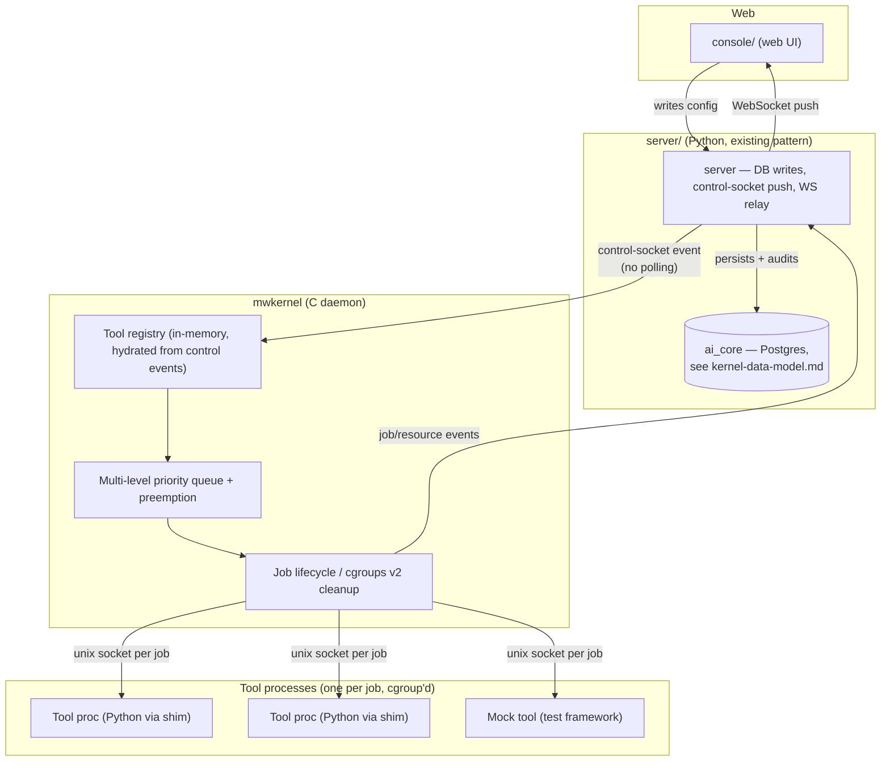

# Kernel Core & Plugin/Tool Contract — Design Spec

## Metadata
- **Description**: Design for the first sub-project of the new Mindwave Kernel — a C daemon that schedules and isolates work by priority, plus the socket contract that lets any external process (Python today, anything later) register as a pluggable Tool. Built from scratch in this repo; not a fork of `mindwave-aicore`'s existing Python kernel.
- **Last updated**: 2026-08-30

---

## 1. Background & Scope

The goal is a Kernel that controls execution of a Workflow-diagram-style system (the kind `mindwave-aicore` already runs, in Python) but rebuilt with different non-functional goals: written in C for stability, zero hardcoded configuration (everything editable from a web console with no restart), a true plugin architecture (Tools can be added or removed live), and hard guarantees that a finished job returns 100% of the resources it used.

This is one sub-project of a larger decomposition — the full request breaks into independent pieces that each need their own design/plan cycle:

| # | Sub-project | Status |
|---|---|---|
| A+B | **Kernel core (C) + Plugin/Tool contract** | this document |
| C | Web control plane (live config edit, endpoint creation) | not started |
| D | Realtime push layer (console updates with no refresh) | not started |
| E | Distributed/scaling layer (cluster, load balance) | `Docs/kernel-clustering-design.md` |
| F | Python execution bridge (Tool-side shim for Python workers) | not started |
| G | Test/mock framework | designed alongside A+B, see §6 |

A depends on nothing else here; B, C, D, F all build against the contract A defines. E is deferred until A is stable, per the earlier decomposition discussion — building cluster support against an unproven single-node kernel would mean redesigning it twice.

## 2. Component Overview

## 3. Kernel Core (C)

- Single-process, epoll-based event loop daemon (`mwkernel`). No business logic lives here — it only knows job descriptor → priority → tool socket.
- **Scheduling**: multi-level priority queue with preemption. A higher-priority job (e.g. a crisis-detection-class Tool) can pause and requeue a running lower-priority job when the resource budget is full, rather than waiting behind it. Priority tiers and their resource caps come entirely from the `priority_policies` table (see [`kernel-data-model.md`](kernel-data-model.md)) — nothing is a compile-time constant.
- **Resource cleanup**: every dispatched job gets its own Linux cgroup v2 slice, sized from its priority policy. The kernel deletes the slice on completion *or* on crash/timeout — this is the actual enforcement mechanism behind "always return resources to the server," not a convention the Tool has to honor. This is a hard requirement of the design (Linux-only by consequence; acceptable since production targets Linux).
- **Tool registry**: in-memory, hydrated at startup and kept current by control-socket events from `server/`. No tool list is ever hardcoded into the kernel binary.

## 4. Plugin/Tool Contract

*(Revised after sub-project A+B implementation — Tasks 6/7 proved the mechanism below in `Core/Kernel/src/job_dispatch.c`; the original "register → receive a job → stream progress/result → exit" phrasing implied a handshake the implementation never needed and doesn't have. This section now describes what was actually built and tested.)*

A **Tool** is registered *at the config level* — a row in the `tools` table, keyed by name, holding `exec_command` and `config`. There is no runtime registration handshake. Per job, the kernel:

1. Forks and execs `exec_command <generated-per-job-socket-path>`, placing the child PID into a fresh cgroup v2 slice sized from the job's priority policy.
2. Connects to the socket the Tool process binds and listens on at startup (the kernel dials the Tool, not the other way around).
3. Sends one framed request; reads one framed response.
4. Waits for the Tool process to exit, then destroys its cgroup.

This is the one abstraction the whole "no hardcode" requirement rests on:

- **Nodes** (today's Python workflow nodes) become Tools via a thin shim library (sub-project F) — their business logic doesn't need a rewrite, only the transport boundary changes.
- **AI provider connectors** (OpenAI, Anthropic, etc.) are Tools too, registered the same way. Adding a vendor is a web action (insert a `tools` row), never a kernel code change.
- **Mock tools** (sub-project G) speak the identical protocol and are just another `tools` row with `is_mock = true` — the kernel cannot tell a test run from a real one, which is what makes the mock trustworthy as a stand-in for scheduling/priority/cgroup behavior.

**Why Unix sockets over gRPC or in-process embedding**: sockets keep each Tool a genuinely separate OS process (crash isolation, independent cgroup, and a real "micro-service" boundary as required) while staying far cheaper than gRPC's schema/codegen overhead for a single-host, mostly-Python-consumer contract. Embedding CPython in-kernel was rejected specifically because a Tool crash must not be able to reach the kernel process.

**Known contract gap — carried forward to sub-projects C/F, not yet resolved**: the current spawn argv is `<exec_command> <socket_path> <mode>`, where `mode` (`"success"`/`"slow"`/`"crash"`) exists only to drive `mock_tool` in tests. A real Tool has no such vocabulary. Before any real Tool (a Node shim, an AI provider connector) is built against this contract, `mode` needs to either disappear (behavior driven entirely by the job payload, which every Tool must parse anyway) or become a documented, Tool-defined convention read from `tools.config` — not a kernel-imposed positional argument. See `Docs/plans/0001-kernel-core-plugin-contract.md` Post-Plan Notes.

**`exec_command` semantics** (undocumented until now, inferred from the implementation): a single executable path, invoked via `execl` with no shell, no `$PATH` lookup, and no way to pass additional fixed arguments — `tools.exec_command` must be an absolute (or otherwise directly executable) path to a binary that itself takes `<socket_path>` and `<mode>` as argv[1]/argv[2]. A command line like `python3 -m mytool.shim` will not work as `exec_command`; it needs a wrapper script or the dispatch code needs argv parsing (not built).

## 5. Configuration & Control Flow ("no restart")

1. `Server/` (Python, existing role, stays as-is) is config source of truth in Postgres — every write is audited (`control_events` table).
2. On any write (priority change, tool enable/disable, endpoint edit), `Server/` pushes an event over the control socket to `mwkernel`, which applies it in memory immediately. No polling loop anywhere in this path.
3. The kernel emits its own events (job started/failed/completed, resource stats) back over the socket. `Server/` persists them to `control_events` and relays them to the console over WebSocket, so the UI updates without a page refresh.

## 6. Crash Handling & Testing

- A Tool crash is detected as a socket disconnect. The kernel tears down that job's cgroup unconditionally, marks the job failed in the event stream, and requeues or surfaces it per the job's retry policy (itself web-configured, not hardcoded).
- The kernel must never crash from a Tool's misbehavior — process + cgroup isolation is the safety boundary, not in-kernel exception handling.
- **Test/mock framework** (sub-project G) is built alongside the kernel, not after: a mock Tool binary speaks the real protocol and returns canned responses, letting scheduling/priority/cgroup logic be exercised end-to-end with zero real API calls.
- Given the explicit "stable, no bugs" goal, kernel unit tests (priority queue ordering, preemption correctness, cgroup lifecycle) run under ASan/valgrind in CI — memory safety is verified, not assumed.

## 7. Data Model

See [`kernel-data-model.md`](kernel-data-model.md) for the full schema (`tools`, `priority_policies`, `jobs`, `api_endpoints`, `control_events`) and the ER diagram. Local dev database: `ai_core` (Postgres), already provisioned.

## 8. Out of Scope for This Spec

- Web control plane UI/API details (sub-project C)
- Realtime transport implementation specifics (sub-project D) — the event flow above assumes it exists but doesn't design the WebSocket layer itself
- Clustering, load balancing, multi-node coordination (sub-project E)
- The Python-side shim library implementation (sub-project F) — this spec only fixes the socket contract it must speak
