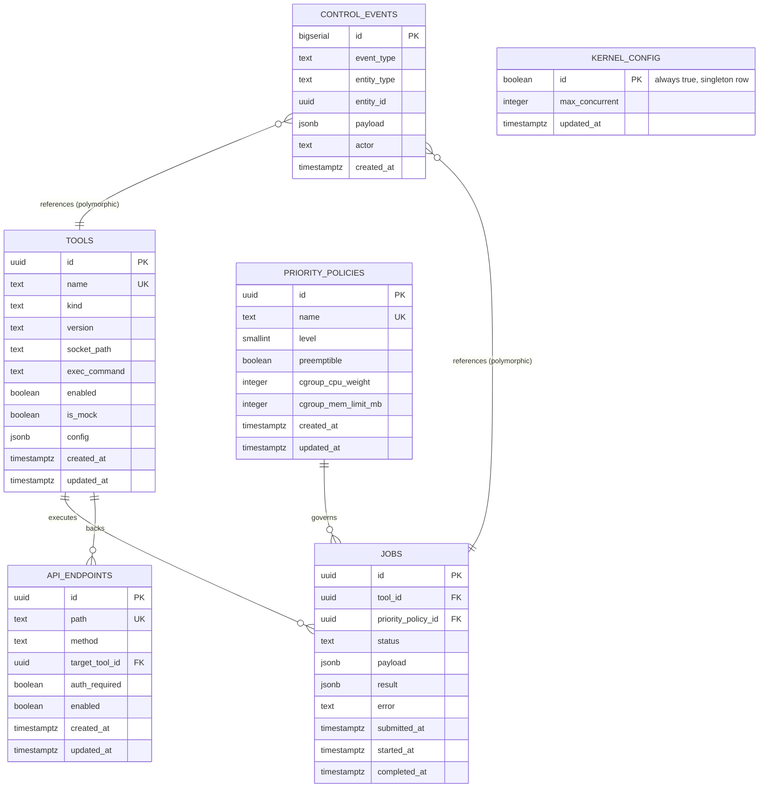

# Kernel Data Model

## Metadata
- **Description**: Postgres schema (`ai_core` database) backing the C kernel's control plane — tool registry, priority policy, job tracking, web-created API endpoints, and the audit/event log that drives realtime push to the console.
- **Last updated**: 2026-08-31

---

## Overview

This document defines the tables the kernel's control plane reads and writes. The kernel itself holds no business logic and no persistent state of its own — `server/` (the existing web-facing process) is the source of truth for everything here, and pushes changes to the kernel over the control socket described in [`kernel-core-design.md`](kernel-core-design.md). Every table exists to satisfy one requirement from that design: no hardcoded tool list, no hardcoded priority levels, no hardcoded API surface, and a durable trail for the realtime event stream.

Scope note: this schema covers the Kernel Core + Plugin/Tool Contract sub-project only. Clustering/multi-node tables are deliberately left out — that's a later sub-project and would be speculative to design now.

## Entity-Relationship Diagram

## Table Notes

### `tools`
One row per pluggable Tool the kernel can dispatch a job to — a wrapped Node, an AI provider connector, or a mock tool used by the test framework. `kind` distinguishes these (`node` / `ai_provider` / `mock` / `utility`); no separate table per kind, since the contract (register → receive job over the tool's socket → stream result) is identical for all of them — that uniformity is the entire point of the plugin contract. `is_mock` lets the test framework (subsystem G) reuse this same table instead of a parallel one.

`config` (JSONB) holds everything web-editable about the tool — endpoint URLs, model lists, timeouts. **It must never hold raw secret material** (API keys, tokens): those are referenced by name from an external secrets store, not stored here — the same no-secrets-in-plaintext-config principle already enforced in this repo's agent-team rules (`.claude/rules/knowledge_system.md`).

### `priority_policies`
Named priority tiers, web-editable, read by the kernel's multi-level preemptive queue. `cgroup_cpu_weight` / `cgroup_mem_limit_mb` are the resource caps the kernel applies to a job's cgroup v2 slice at dispatch time — this is what makes "priority" mean something concrete at the OS level, not just a sort key. **No `max_concurrent` column** — job concurrency is capped daemon-wide by `kernel_config`, not per policy (see below; this was a deliberate correction during the sub-project C1 design, not the original schema — a per-policy cap made a preempted victim's freed slot invisible to the policy that needed it, so preemption could never actually admit the job that triggered it).

`preemptible` is a correctness contract, not just a scheduling hint (see `Docs/kernel-daemon-assembly-design.md` §5.1): preemption is kill-and-requeue, not pause/resume, so a preempted job's side effects up to the kill point already happened and will happen again on rerun. `preemptible = true` asserts the tool's work is idempotent or safely re-runnable — anything with non-idempotent external side effects (a message already sent, a charge already made) must be registered with `preemptible = false`.

### `kernel_config`
Singleton row (`id` is always `true`, enforced by a `CHECK (id)` constraint) holding daemon-wide runtime settings — today just `max_concurrent`, the single shared ceiling on concurrently-running jobs across every tool and policy. Web-editable like everything else here; `Server/` pushes changes as a `kernel.config` control-channel message (`Docs/kernel-daemon-assembly-design.md` §5) and the kernel starts with `max_concurrent = 0` (admits nothing) until the first push arrives, matching the "starts empty, populated only by control messages" rule the `tools`/`priority_policies` registries already follow.

### `jobs`
One row per unit of work dispatched to a tool. `status` transitions: `queued → running → (completed | failed | cancelled)`, with `preempted → queued` as a valid loop-back when a higher-priority job needs the resources a running job holds. Rows are never deleted — this table doubles as the job history the console reads for realtime status.

### `api_endpoints`
Endpoints created from the web console with no code deploy. Each one maps a path+method to a `tools` row that handles it — creating an endpoint is really just registering a routing rule, not writing a handler.

### `control_events`
Append-only. Two jobs: (1) the audit trail for every config change ("no hardcode" requires a config to actually be changed by *someone*, traceably), and (2) the backing store for the realtime WebSocket feed to the console — the console can also replay recent events on reconnect instead of needing a persistent connection to never drop. `entity_type`/`entity_id` is a polymorphic reference (no FK constraint) since an event can point at a tool, a job, a priority policy, or an endpoint.

## Deliberately Not Modeled Here

- **Cluster node registry** — now speced in `Docs/kernel-clustering-design.md` (sub-project E: `kernel_nodes` table, `kernel_config` singleton→per-node, `jobs.node_id`), not part of this document's schema.
- **Secrets/credentials** — referenced by name from `tools.config`, never stored in this database. Where they live is a decision for whatever secrets-management approach gets chosen when AI-provider tools are actually built.
